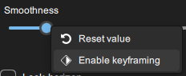
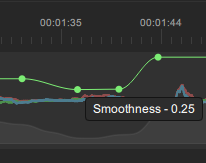
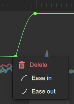
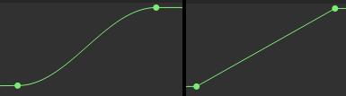

# 🔑 Keyframes

Most parameters in Gyroflow can be keyframed - meaning their value can be changed in different parts of the video (i.e. you can use a different smoothness at the start of the video, compared to the end).

## How to use?

### Enabling keyframes

Keyframes can be enabled by right-clicking on the slider and choosing **Enable keyframing.**

<figure><figcaption></figcaption></figure>

Then, go to a time in the video when you want the value to be different and just change the slider value. This will create a keyframe on the timeline chart.

<figure><figcaption>
Smoothness keyframe
</figcaption></figure>

### Keyframe easing

You can right-click the keyframe point to enable or disable easing (it's enabled by default).

<figure><figcaption></figcaption></figure>

<figure><figcaption>
Ease in + out vs. linear keyframe
</figcaption></figure>

### Removing/disabling keyframes

You can right-click the keyframe point to delete it, or to disable all keyframing for a slider, right-click on the slider and uncheck **Enable keyframing** - this will clear all keyframes on that slider.

## Keyframeable parameters

* Smoothness
* FOV
* Zooming speed
* Zooming center offset
* Horizon lock amount / roll correction
* Lens correction strength
* Max smoothness
* Max smoothness at high velocity
* Pitch/Roll/Yaw smoothness
* Video rotation
* Background margin / feather
* Video speed

## Example



## Caveat

When keyframing zooming speed and the speed changes are significant, make sure to switch the zooming algorithm to **Envelope follower.**&#x20;

There is a known bug with the **Gaussian filter** algorithm which may lead to black borders in view when keyframing zooming speed.
