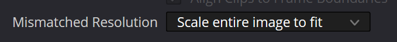

# ⏩ Render queue

### Where is render queue?

Render queue can be accessed by clicking the queue icon, next to the **Export** button.

<figure><figcaption>
Render queue icon
</figcaption></figure>

You can also toggle the render queue by using the `q` keyboard shortcut.

### Adding to the render queue

There are 2 ways to add a file to the render queue:

1. Open a video file in Gyroflow, adjust your settings, then click on the arrow icon on the **Export** button and choose **Add to render queue**
2. Drag & drop your video file directly to the render queue.

You can also drag & drop the .gyroflow project file to the render queue.


When you add a video file directly to the render queue, it will use the settings that are currently set in the main window.


### Settings presets

Instead of using the current GUI settings, you can also apply your **settings preset** to all items in the render queue. Simply drag & drop the preset (.gyroflow file) into the render queue and it will apply it to all items. Note that the preset is only applied to items in the queue. Once you add new files, you have to use the preset again to apply for new files. You can also use the `default.gyroflow` preset to automatically apply for all new items. Read more in the [**⚙ Settings presets**](render-queue.md#settings-presets) section.

### Automatic synchronization in the render queue

If your file requires [**⌛synchronization**](../getting-started/basic-usage/synchronization.md) (anything other than GoPro 8+ or DJI), it can also be done in the render queue. For that, the lens profile needs to have the synchronization parameters included (read more on [**Advanced usage -> 🔭 Lens profiles**](lens-profiles.md)), or your settings preset needs to have synchronization parameters and **Do autosync** checked.

### Apply specific settings to all items in the queue

If you want to change just one or a few parameters in all items of the queue, you can set the desired values in the main Gyroflow window, and then use the arrow icon on the **Export** button, and choose **Apply selected settings to all items in the render queue**. Then select which setting you want to apply.

### Queue settings

<figure><figcaption>
Render queue settings menu
</figcaption></figure>

#### Number of parallel renders

You can choose how many files you want to render in parallel. Gyroflow is designed to use maximum possible resources when rendering so rendering just one file at a time should be enough. In some cases, 2 or 3 files in parallel can render faster, but in general anything more than 2 will probably not render any faster.

#### Default overwrite action

You can choose default action to take when the output file already exists on disk.

**Export mode**

Render queue can also be used to export project files, instead of rendering a stabilized video file. This can be useful if you have a lot of videos you want to use with the [**Video editor plugin**](../video-editor-plugins/general-plugin-workflow.md). You can add all your video files to the render queue as usual and then click on the **Queue settings -> Export mode -> Project file (with gyro data)**. This mode will create a `.gyroflow` project file for each video in the queue, instead of rendering stabilized video.

#### Action when done

Once your render queue is finished, you can choose what Gyroflow should do, by setting **When rendering is finished** option on the left bottom corner of the render queue. Possible actions include: Close the program, shutdown the computer, restart computer, hibernate or put the computer to sleep etc.

### Output directory

Default output directory for files dropped into the render queue is the same folder as the video file. However, if the **Output path** field on the bottom of Gyroflow contains a path, then all files dropped to the render queue will be rendered to that folder.

### Preserving the render queue

If you have some items in the render queue and you close the program (or it crashes), then all items should be restored when you start Gyroflow again.

