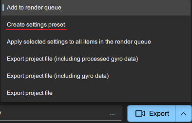
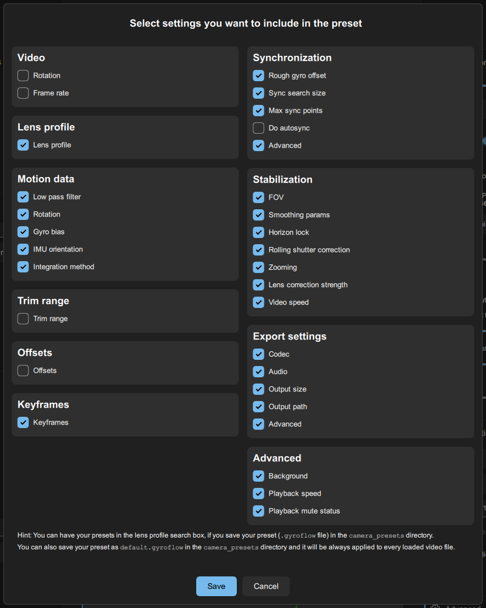
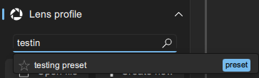

# ⚙ Settings presets

Presets can be used to store your common preferred settings in the UI. You can then have them in the Lens profile search box, or you can drag &  drop them in the UI or in the [render queue](render-queue.md), or use in the [CLI](command-line-cli.md).

## Creating presets

In order to create a preset, set any settings you want in the UI, then click on the arrow on the **Export** button and choose **Create settings preset.**

<figure><figcaption></figcaption></figure>

Then simply select settings you want to include in the preset:

<figure><figcaption></figcaption></figure>


If you save the preset in `camera_presets` directory, it will show up in the Lens profile search box. It can be favorited and searched.


<figure><figcaption>
Preset in the lens profile search box
</figcaption></figure>

## Default preset

If you save your preset as `default.gyroflow` in the `camera_presets` directory, it will be loaded automatically with every video.

`default.gyroflow` loads in the main window, as well as in the render queue.&#x20;
