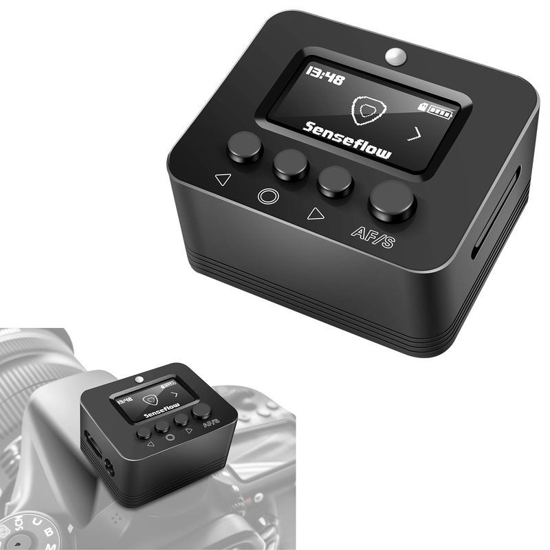
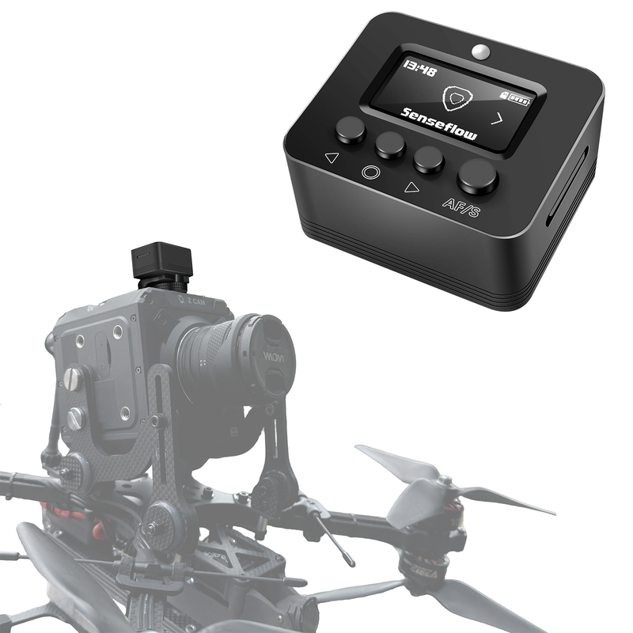
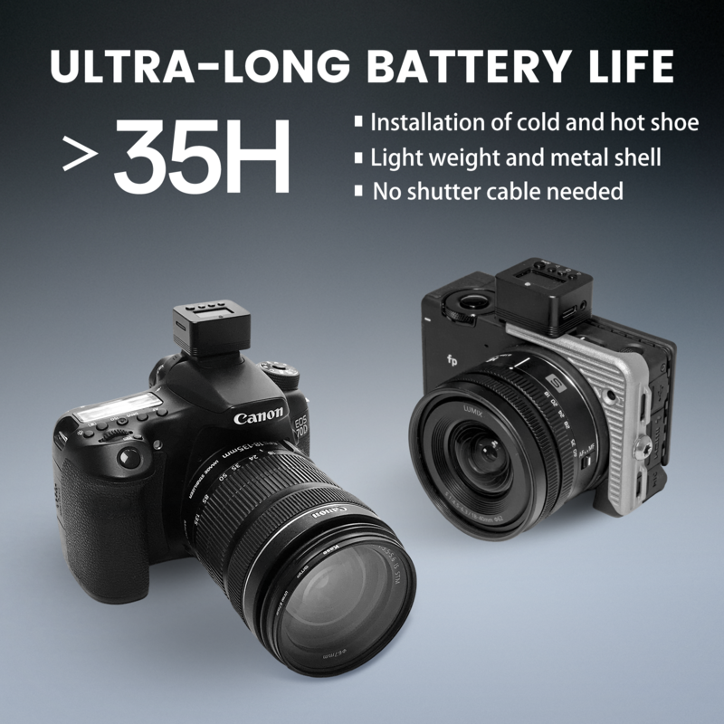
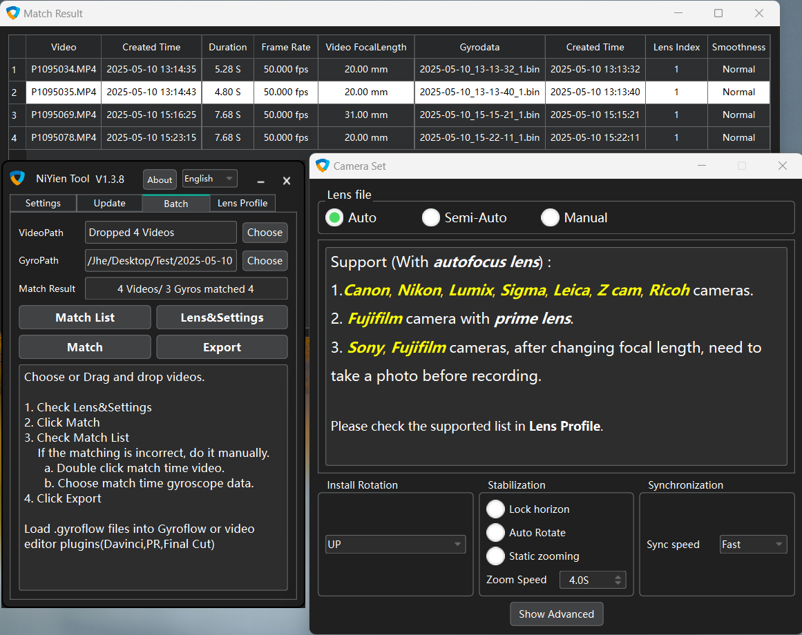
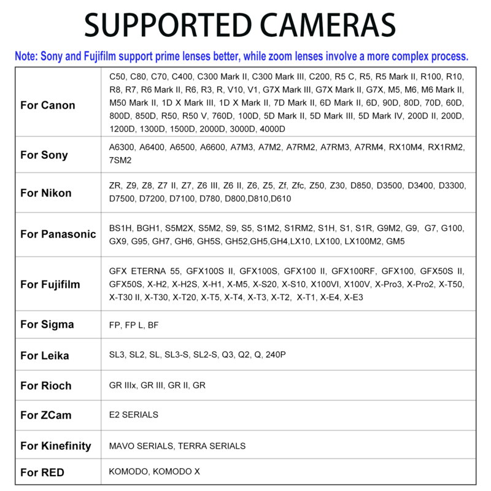
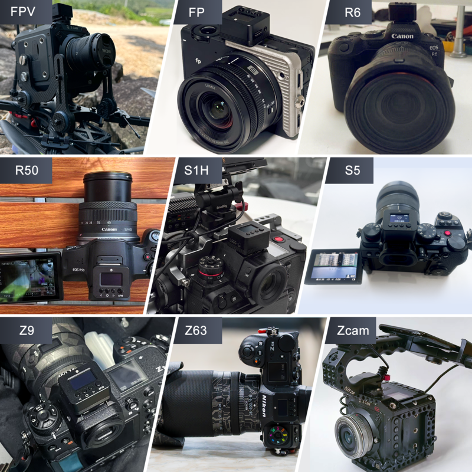

# NiYien-A1

## NiYien A1: Camera Stabilizer Box

_Designed for Gyroflow Video Stabilization_

<figure><figcaption></figcaption></figure> <figure><figcaption></figcaption></figure>

***

### 1. Overview

The NiYien A1 is a dedicated external gyroscope for **Gyroflow** — the open-source video stabilization tool. It captures high-precision real-time motion data, which Gyroflow uses to eliminate camera shake for ultra-smooth footage.

***

### 2. Core Advantages

#### 2.1 Compact & Durable Build

* **Hot & Cold Shoe Compatibility**: Snaps to standard camera hot shoes (no extra adapters).
* **Ultra-Lightweight**: Less than 30g — won’t disrupt camera balance or portability.
* **Long Battery Life**: Over 35 hours of continuous recording.
* **High Sampling Rate**: 1000Hz motion capture for accurate stabilization data.
* **Full-Metal Build**: Resists scratches and impacts for long-term use.

<figure><figcaption></figcaption></figure>

#### 2.2 Hassle-Free Operation

* One-time synchronization with your camera, then it records **continuously**.
* “Set-and-Forget” workflow: Use your camera as usual — no extra steps during shooting.

#### 2.3 NiYien Tool: Streamline Gyroflow (See screenshot below for full features)

A dedicated desktop tool for batch stabilization:

* Preloaded profiles for **100+ camera models** — skip manual lens file creation.
* Batch-adjust Gyroflow settings (Smoothness, Horizon Lock, Static Zoom).
* **Batch export options**: Export stabilized videos or `.gyroflow` project files for plugins in DaVinci Resolve, Premiere Pro (PR), and other video editors.
* Supports vertical shooting, slow-motion, anamorphic lenses, and RAW videos.

<figure><figcaption></figcaption></figure>

***

### 3. Support List

The support list is regularly updated — for the latest version, please refer to the display on the sales platform.

<figure><figcaption></figcaption></figure>

Samples:

<figure><figcaption></figcaption></figure>

***

### 4. Tutorials & Gallery

* 📚 **Video Tutorial**: [https://www.niyien.com/NiYien\_manual\_EN.html](https://www.niyien.com/NiYien_manual_EN.html)
* 📚 **Text Tutorial**: [https://www.niyien.com/NiYien\_txt\_manual\_EN.html](https://www.niyien.com/NiYien_txt_manual_EN.html)
* 📚 **Video Gallery**: [https://youtube.com/playlist?list=PLojP8A0Y0pejRVO1qT3Jbav6641m4fg9V\&si=grJqOwnqD2Rt7YxX](https://youtube.com/playlist?list=PLojP8A0Y0pejRVO1qT3Jbav6641m4fg9V\&si=grJqOwnqD2Rt7YxX)
* 📚 **Test Files**：[https://drive.google.com/file/d/1Gv2pa0O\_0LAM6vweo7HD8dQ8uZKv2r2K/view?usp=sharing](https://drive.google.com/file/d/1Gv2pa0O_0LAM6vweo7HD8dQ8uZKv2r2K/view?usp=sharing)

***

### 5. Purchase

* 📦 **Amazon (US)**: [https://www.amazon.com/dp/B0FPMLBK45](https://www.amazon.com/dp/B0FPMLBK45)
* 📦 **AliExpress**: [https://www.aliexpress.us/item/3256808861378990.html](https://www.aliexpress.us/item/3256808861378990.html)

***

### 6. Support

* 📧 **Support Email**: Technical help (troubleshooting, setup issues) at support@niyien.com.
* 📧 **Sales Email**: Inquiries about bulk orders, partnerships, or purchase quotes at sales@niyien.com.
* 💬 **Discord**: Join for real-time support, user discussions, and product update notifications at [https://discord.gg/dyna2DtqEA](https://discord.gg/dyna2DtqEA)
