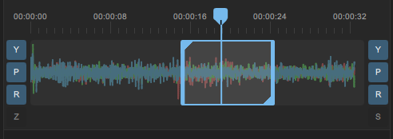

# 🎬 Exporting

## Render range

You can set the desired section of your video to be renderred by setting the Trim range on the timeline. You can use `[` and `]` buttons or `i` and `o` keys to set the start and end of the range you want to export.

<figure><figcaption>
Trim range
</figcaption></figure>

## Output path

You can enter the desired location and file name for the output file at the bottom of Gyroflow, in the `Output path` area

## Export codec

| Codec            | Description                                                                                                                                                                                                                                                                                                                                                                                                         |
| ---------------- | ------------------------------------------------------------------------------------------------------------------------------------------------------------------------------------------------------------------------------------------------------------------------------------------------------------------------------------------------------------------------------------------------------------------- |
| **H.264/AVC**    | 
Most widely supported codec. It should work on all computers, mobile phones and on the web. Faster to render than H.265 but less efficient.  Hardware accelerated encoder supports only 8-bit files with this codec.
                                                                                                                                                                                   |
| **H.265/HEVC**   | 
Newer and more efficient codec than H.264/AVC. Requires more processing power to encode and to decode. If you have older hardware, it's possible HEVC file will be hard to playback. In this case choose H.264. If your hardware supports it well, you can prefer it over H.264, as it delivers better quality at the same bitrate.  Supports 10-bit encoding with hardware (depending on the GPU).
 |
| **ProRes**       | 
Professional video codec, especially good for working on the files later in a video editor (it's fast to decode). Good for maintaining maximum video quality.   Hardware acceleration for ProRes is available only on macOS with M1 Pro/Max/Ultra (but not M1 Air) and M2 chips (including M2 Air).
                                                                                                    |
| **DNxHD**        | Similar to ProRes. No hardware acceleration is available.                                                                                                                                                                                                                                                                                                                                                           |
| **EXR sequence** | Image sequence in the `.exr` format. Data is stored as 32-bit float. Compression is lossless.                                                                                                                                                                                                                                                                                                                       |
| **PNG sequence** | Image sequence in the `.png` format. Data is stored either as 8-bit or 16-bit. Compression is lossless.                                                                                                                                                                                                                                                                                                             |

## Output size

You can control the exported resolution here. If you want to output a different size or aspect ratio, you can enter it here.

If you want to change the aspect ratio (e.g. 4:3 source rendered as 16:9 video), you can also do that here. The resulting resolution is the rectangle that the stabilized video can move around in. Therefore it also affects the stabilization, it's not a static crop. \
\
If you have a horizontal video and want to output 9:16 for social media, you can set 9:16 resolution here.  It's also common to keyframe the center offset (`Stabilization -> Zooming -> Advanced -> Zooming center offset`) and move the video right-left to keep the subject in frame.

## Bitrate

Bitrate is the amount of data stored in a second of the video. Bigger bitrate will produce better quality and bigger file size. By default Gyroflow sets the same bitrate as the input file.

## GPU encoding

Video encoding is a very compute-intensive task. Rendering on the CPU[^1] is very slow.

Modern graphic cards implement hardware accelerated video encoders and is generally preferrable to have GPU encoding enabled.

Support for codecs and modes varies greatly between GPU brands and models, for more information refer to specific guides for [NVIDIA](../../hardware-acceleration/nvidia.md), [AMD](../../hardware-acceleration/amd.md), [Intel](../../hardware-acceleration/intel.md), [macOS ](../../hardware-acceleration/apple-macos.md)or [Android](../../hardware-acceleration/android.md). If you don't know what GPU you have, refer to your computer specifications.

If your computer is older than 2016, chances are H.265/HEVC will not be available, and if it's older than 2012, H.264 may also not be available.

If you want maximum possible encoding quality and don't mind waiting, you can disable GPU encoding. Rendering on the CPU in general provides better results, but it's much slower. \
For most use cases the difference will be negligible and enabling GPU encoding is preferred.

## Audio

Audio can be exported as well, and it will be transcoded to the AAC format. The audio format can't be changed at this time.

## Advanced

For advanced options, see the `Advanced usage -> Exporting` section


[exporting.md](../../advanced-usage/exporting.md)


## Exporting

Once you have all settings dialed in, you can proceed to render by just clicking the blue `Export` button.

Render queue is available by clicking the icon on the right of the `Export` button. You can add your render task to the queue by clicking the arrow on the `Export` button and choosing `Add to render queue`

<figure><figcaption>
Render queue icon
</figcaption></figure>

For more information about the render queue, see the `Advanced usage -> Render queue` section


[render-queue.md](../../advanced-usage/render-queue.md)


## Saving the project file

You can export a project file which will contain all your settings, lens profile and optionally the gyro data. You can then load that project file later if you want to adjust any settings and re-render.

There's a `Ctrl + S` keyboard shortcut available to quickly save the project file with gyro data included. The resulting file also works with the video editor plugins.

## Exporting data for the plugins

You don't have to render out the file from Gyroflow, you can also use the [video editor plugins](../../video-editor-plugins/general-plugin-workflow.md) and apply the stabilization directly in your video editor. For more information see the `Video editor plugins` section


[general-plugin-workflow.md](../../video-editor-plugins/general-plugin-workflow.md)


[^1]: computer processor
