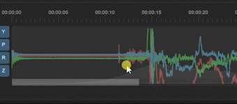

# 📈 Timeline and gyro chart

In the bottom section of Gyroflow, you can see the timeline, which shows the loaded motion data. This is a very important tool to determine correct synchronization, so make sure you learn how to use it.

It contains 4 layers of data:

1. Darker lines, filling entire chart - this is the motion data as recorded by the camera.
2. Lighter lines, they show up only after running autosync, and only at specified points - this is the motion data calculated from optical flow by analyzing the video pixels visually. This data always corresponds to the video and is not affected by sync points.
3. Sync points - vertical lines with time values below them. This is the time offset by which the motion data is shifted to match the video movement.
4. Dynamic zooming percentage - the bottom half of the chart shows a very light, filled overlay - this is the amount of zoom at a particular video time.

<figure><figcaption>
Timeline elements overview
</figcaption></figure>


When using sync-less video files (GoPro Hero 8+ and DJI) you can skip this part entirely, as the synchronization is already correct and accurate, and no additional sync points should be added.


**The goal is to have the lighter lines lined up with the darker lines.**

In order to do that, synchronization points need to be added, which shift the darker lines in time (left or right on the chart).

## Zooming and panning

To see what's actually going on on the chart, you'll need to zoom it in. Use:

* **mouse wheel** to zoom in and out horizontally
* **Alt + mouse wheel** (on macOS: Control + Shift + mouse wheel) to zoom in and out vertically
* **middle mouse button** or **Ctrl + mouse wheel** (on macOS: Command + mouse wheel) - to pan the view left and right


Example of zooming in to inspect the sync points



If you see minor shift of the lighter lines, but it roughly matches (like on the above example), this is usually fine and expected - trying to align it manually to perfectly cover the lines may actually make it worse. You should mostly rely on the autosync.&#x20;

Because of rolling shutter effects, the lines won't be perfectly aligned on chart when the sync is perfect, so first of all you should check if your video is stabilized by playing it, instead of aligning the lines with each other at all costs.


## Context menu

#### Auto sync here

Analyze the video visually here and produce optical flow motion data and a sync point. The amount of time to analyze is specified by _Synchronization -> Advanced -> Time to analyze per sync point_.

This option will run the optical flow algorithm and show the resulting motion data as lighter lines on the chart. It will then try to calculate the correct sync point using that data. You will usually use this option to add new optical flow data to the chart and produce a new sync point.

This may also produce a bad sync point. You can then remove the bad sync point and use other techniques to align the chart or assess the correctness of the sync using the produced lighter lines, which will remain on the chart.


The main **Auto sync** button in the Synchronization section (on the right) just picks a few points in the video and calls "Auto sync here" at these points, so these functions are equivalent.


Keyboard shortcut: `a`

#### Add manual sync point here

This option can be used to add a new sync point without running autosync or optical analysis - it can be used to shift the motion data manually by using the slider below the sync point. It's usually not recommended to use this option.

Keyboard shortcut: `p`

#### Guess IMU orientation here

If your motion data is facing a different direction than the video and lines on the chart don't align (or have different colors when aligned) - you'll need to determine correct IMU orientation. You can use this option to attempt to guess the correct IMU orientation. Read [**🔀 IMU orientation and rotation**](../../advanced-usage/imu-orientation-and-rotation.md) **** to learn the exact process. After changing IMU orientation, remove all sync points and do the synchronization again.

#### Estimate gyro bias here

Estimating gyro bias can help achieve better stabilization results. To estimate the bias, you'll need to have a moment in your video where the camera is not moving at all. In the FPV case it can be before take off. After estimating bias, remove all sync points and do the synchronization again.

<figure><figcaption>
Gyro bias estimation
</figcaption></figure>

#### Estimate rolling shutter here

TODO

#### Chart display mode

The motion data chart can show 4 different data sources: Gyroscope, Accelerometer, Magnetometer and Quaternions

Quaternions are always available because they are either provided by the camera, or created from Gyroscope and Accelerometer by using a _sensor fusion_ algorithm. For example DJI cameras contain only Quaternions without gyro data, because the _sensor fusion_ is ran inside the camera.&#x20;

Gyroscope readings represent a speed of rotation (rotating up/down/right/left) and Accelerometer readings represent a speed of translation (moving up/down/right/left). By using these values over time, we can calculate the quaternion - a 3d camera orientation in space, and that is used for all stabilization algorithms in Gyroflow.


In the quaternion chart mode, lighter lines represent **smoothed orientation**, instead of optical flow data.


## Zooming information

The bottom half of the chart contains dynamic zooming information - it's the light filled overlay on the chart, and it indicates how much a video is zoomed in at that time. It can be enabled or disabled by clicking the "Z" button on the left side of the chart.&#x20;

If you increase FOV value to more than 1 or disable dynamic zooming, the chart will also show a red overlay. This indicates that the video is showing the background at that time, i.e. source video pixels don't cover the entire output frame at that time.

## Sync points

Read about sync points on the [**⌛ Synchronization**](synchronization.md) page.
