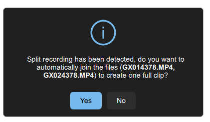
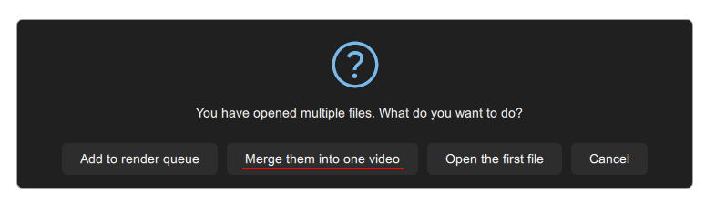

# 🎞 File joiner

Most consumer cameras have a file size limit of 4 GB. If the recording is longer, it will be split into multiple parts. If you want to stabilize such split video, you'll have to merge the parts before stabilization.\
\
Gyroflow has a built-in tool to do that for you.

### GoPro

In case of GoPro files, it should detect the sequence automatically and ask you to merge the videos, when you load the first file from the sequence:

<figure><figcaption></figcaption></figure>

You can also use [**ReelSteady-Joiner**](https://github.com/rubegartor/ReelSteady-Joiner) to merge GoPro files, or follow the guide [here](https://gopro.github.io/labs/control/chapters/).

You can prevent this from happening by using [GoPro Labs](https://gopro.github.io/labs/). It has a feature called [Large Chapters](https://gopro.github.io/labs/control/chapters/), and enabling it will make the camera record big video files over 4 GB, up to 12 GB.

### All other cameras

In case of all other cameras, you can simply drag & drop all files in your sequence to Gyroflow, and it will ask you if you want to merge them:

<figure><figcaption></figcaption></figure>

When joining video files from RunCam cameras, which have corresponding `.gcsv` files, the `.gcsv` files with gyro data will also be automatically merged.

### Standalone tool

The Gyroflow file merger is also available as a standalone CLI tool: [**mp4-merge**](https://github.com/gyroflow/mp4-merge)

