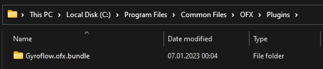

# DaVinci Resolve plugin (OpenFX)

## Supported hosts

1. DaVinci Resolve
2. MAGIX Vegas
3. Possibly other OpenFX-compatible hosts, however they were not tested

## Installation



## Installing the OpenFX plugin

1. Download the latest version from [https://gyroflow.xyz/download#plugins](https://gyroflow.xyz/download#plugins)
2. Extract `Gyroflow-ofx-windows.zip` somewhere
3. Create the OFX folder: `C:\Program Files\Common Files\OFX\Plugins`.
4. Copy `Gyroflow.ofx.bundle` folder to `C:\Program Files\Common Files\OFX\Plugins`

<figure><figcaption>
Properly installed plugin on Windows
</figcaption></figure>

## Hardware acceleration

Gyroflow OFX plugin supports OpenCL and CUDA acceleration on Windows

## Latest development build

If you want to check out latest features and fixes, you can download the latest dev build from [https://nightly.link/gyroflow/gyroflow-ofx/workflows/build/main/gyroflow-ofx-windows.zip](https://nightly.link/gyroflow/gyroflow-ofx/workflows/build/main/gyroflow-ofx-windows.zip)

The list of all nightly builds is available on [GitHub actions](https://github.com/gyroflow/gyroflow-ofx/actions)



## Installing the OpenFX plugin

1. Download the latest version from [https://gyroflow.xyz/download#plugins](https://gyroflow.xyz/download#plugins)&#x20;
2. Create the OFX folder: `/Library/OFX/Plugins`.&#x20;
   1. You can do that in Finder or in the Terminal: `sudo mkdir -p /Library/OFX/Plugins ; open /Library/OFX/Plugins`.
3. Run `Gyroflow-ofx-macosx.dmg`
4. Copy `Gyroflow.ofx.bundle` folder to `/Library/OFX/Plugins/`


Make sure the OFX folder is in the root `/Library` folder, not your user `/Users/you/Library`


<figure><figcaption>
Properly installed plugin on macOS
</figcaption></figure>

## Hardware acceleration

Gyroflow OFX plugin supports Metal acceleration on macOS

## Latest development build

If you want to check out latest features and fixes, you can download the latest dev build from [https://nightly.link/gyroflow/gyroflow-ofx/workflows/build/main/gyroflow-ofx-macosx.zip](https://nightly.link/gyroflow/gyroflow-ofx/workflows/build/main/gyroflow-ofx-macosx.zip)

The list of all nightly builds is available on [GitHub actions](https://github.com/gyroflow/gyroflow-ofx/actions)



## Installing the OpenFX plugin

1. Download the latest version from [https://gyroflow.xyz/download#plugins](https://gyroflow.xyz/download#plugins)&#x20;
2. Create the OFX folder: `/usr/OFX/Plugins`.&#x20;
   1. You can do that in the Terminal: `sudo mkdir -p /usr/OFX/Plugins && sudo chown $USER /usr/OFX/Plugins`.
3. Extract`Gyroflow-ofx-linux.zip` to `/usr/OFX/Plugins`

<figure><figcaption>
Properly installed plugin on Linux
</figcaption></figure>

## Hardware acceleration

Gyroflow OFX plugin supports OpenCL and CUDA acceleration on Linux

## Latest development build

If you want to check out newest features and fixes, you can download the latest dev build from [https://nightly.link/gyroflow/gyroflow-ofx/workflows/build/main/gyroflow-ofx-linux.zip](https://nightly.link/gyroflow/gyroflow-ofx/workflows/build/main/gyroflow-ofx-linux.zip)

The list of all nightly builds is available on [GitHub actions](https://github.com/gyroflow/gyroflow-ofx/actions)



