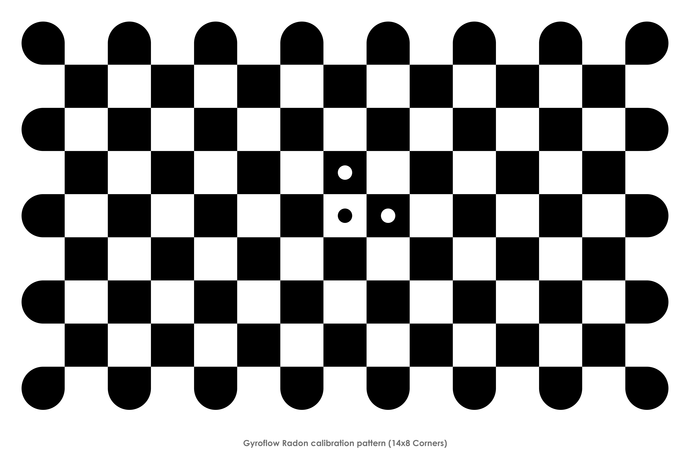

# 🏁 Lens Calibration

The purpose of the lens calibration process is to accurately determine the _intrinsic_ parameters of a camera system. This consists of:

* focal length
* lens distortions
* other misalignments during the imaging process.

The lens calibration process is divided into 2 steps:

## 1. Recording the calibration footage

1. Open Gyroflow, go to **Lens profile** -> **Create new -> Open calibration target**
2. Display the calibration pattern on a **flat** computer monitor (a curved display will **not** work), in full screen. In general, larger calibration patterns are preferred since focus will be closer to the focus during actual use, so use your largest screen/monitor. If you have a large flatscreen TV, it's preferred to display it on the TV (you can use HDMI, or the TV browser to open this page). A bright screen with a slightly darkened room works well.
3. Select the desired camera settings to calibrate for. Most importantly the field of view/focal length and aspect ratio, if applicable. Framerate and resolution doesn't matter, only if the resolution changes the field of view. Use high shutter speed to avoid motion blur, and make sure the calibration target stays in focus.
4. Record the pattern while slowly moving around to different angles and distances in one clip. 60 seconds is typically enough. Try to avoid motion blur and rolling shutter distortion with slow and steady movements, and make sure the full chessboard is in view. The following angles are recommended for getting distortion information from the full frame:
5. Chessboard filling whole frame
6. Chessboard seen from distance.
7. Chessboard seen at an angle.
8. Each edge of video frame aligned with edge of chessboard.
9. Corner of chessboard aligned with corner of video.
10. Finally, get fast motion for rolling shutter reference/estimation by doing a fast side-to-side yaw motions with the camera. This will produce rolling shutter effect where the lines will be bent, instead of straight.

Here's an example of a calibration footage that covers all needed angles:



The calibration pattern can be displayed from the calibration utility. Alternatively, the default (14x8 radon) calibration pattern is available here:

<figure><figcaption></figcaption></figure>

## Rolling shutter correction

Related to lens calibration is estimating the rolling shutter frame readout time. Most DSLR's and consumer-grade video cameras use a [rolling shutter](https://en.wikipedia.org/wiki/Rolling\_shutter) sensors, which introduce warps and distortions in moving footage. It is highly recommended to get an accurate estimate of the rolling shutter _before_ lens calibration and fill in the value in the calibration utility, but it can be done afterwards as well.

Please have a look at [gyroflow/rollingshutter](https://github.com/gyroflow/rollingshutter) for an accurate method of measuring rolling shutter or below for an estimated approach.

### A simple method of determining rolling shutter value

If your calibration video has matching gyro data, the following approach can be used to check the stabilization and estimate the rolling shutter visually. This method only works if the calibration clip had matching gyro data.

1. Load the same clip in main window, load the lens profile you just calibrated, sync the gyro with video.
2. Focus on that fast sideways motion part, go to **Stabilization** -> **Rolling shutter correction**, and move the slider until the rolling shutter effect is fixed, ie. the lines become straight and are not bent anymore. You may need to reverse the rolling shutter direction.
3. Edit your created lens profile json with notepad, and replace `"frame_readout_time": null,`, to e.g. `"frame_readout_time": 15.5,` (15.5ms is an example value). This value will automatically be applied when using this preset.

**`TODO:`**` `` ``add a video sample `

An alternative and much more accurate method doesn't require gyro data, but instead requires an Arduino+LED or similar to generate a precise blinking frequency at e.g. 1 KHz. If you have the hardware, this is recommended over the visual method since it's an order of magnitude more accurate. Read more at [gyroflow/rollingshutter](https://github.com/gyroflow/rollingshutter).

## 2. Analyzing the recorded calibration footage

1. Open Gyroflow, go to **Lens profile** -> **Create new.**
2. Open the previously recorded calibration video file.
3. Either begin auto calibration or manually add frames using `Add calibration point` from the timeline context menu. Note: **Skip the final fast side-to-side motion during this step, by setting the end of trim range just before it.**
4. After all required frames are added and processed, the straight lines should be straight in the undistorted video. `Reprojection error` should typically be under 5 (pixels) with excellent calibrations giving values below 1. The larger the video resolution the bigger this error can be.
5. Fill in the preset information and export the lens profile. Try to add all relevant information about the camera/lens combination including field of view setting and lens focal length if applicable.
6. If rolling shutter information is known in advance, fill in the frame readout time.
7. If a successful calibration was achieved with a low reprojection error and no obvious artefacts, the profile can be submitted with the `Upload lens profile to the database` checkbox.
8. You're now ready to use the new lens preset. These are stored as `.json` files.

## What about anamorphic lenses? 

Refer to [Input stretch](lens-calibration.md#input-stretch)

## Video Guide 

Nurk FPV's tutorial contains a calibration example:



## Additional calibration options 

### Default output size 

Radial lens undistortion typically results in the image being stretched more in the horizontal axis (use the FOV slider to see this). For instance, undistorted 4:3 GoPro video:

Notice that the area of the valid rectangle is close to a 16:9 aspect ratio as opposed to 4:3. In these cases, the default output size can be modified to a 16:9 one.

For cameras with minimal fisheye distortion, or even with pincushion distortion, the resulting valid aspect ratio is close to the original one. For these cameras, just use the input resolution for the default output size.

### Sharpness limit 

Sets the minimum required sharpness for the calibration pattern. If the pattern failed to detect due to focus or blurriness, try increasing this limit.

### Input stretch

If the video file is not exact representation of a real world viewed through a physical, spherical lens, the calibration will not work. To fix that, we need to reverse any additional distortions or in-camera digital processing.

A common example of that is an anamorphic lens. In this case, you need to set the `Input horizontal stretch` to the squeeze factor of the anamorphic lens, to stretch the video horizontally and reverse the anamorphic distortion. This needs to be set before starting autocalibration process.

Another example is a digital processing in camera, like Superview/Hyperview in GoPro cameras, or XV mode in RunCam cameras.

In case of GoPro, the stretch is a custom equation and you can set `Digital lens` to `GoPro Superview`

In case or RunCam, the XV mode is a simple linear stretch, so to reverse it's effect, enter `1.3333` in the `Input vertical stretch` field.

### Focal length and crop factor

If you know the focal length of the lens you're calibrating (most DSLR lenses), you should enter the focal length in that field in Advanced.

If you also know the crop factor (a factor that describes sensor size relation to full frame size), you can also enter it here
