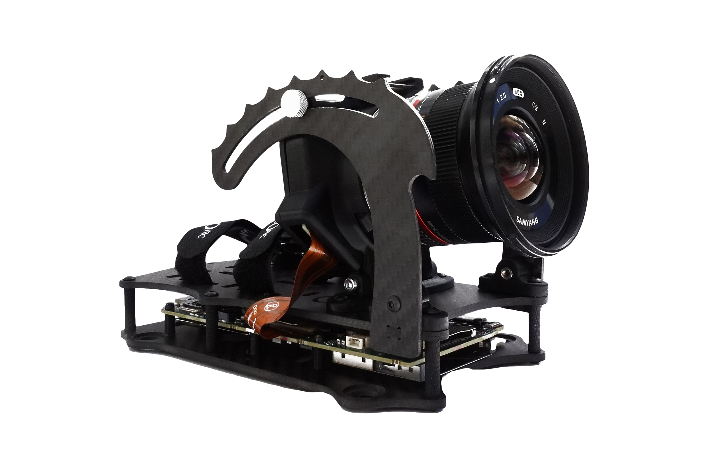

# Blackmagic

Blackmagic has added recording of internal motion data with the firmware **v7.9** available for Blackmagic Pocket Cinema Camera 4k and 6k

## Supported models

<table><thead><tr><th width="283">Model</th><th width="110">Gyro data</th><th width="129">Lens profile</th><th width="166">Synchronization</th></tr></thead><tbody><tr><td>Pocket Cinema Camera 4K</td><td>✅</td><td><mark style="color:yellow;">⚠️</mark> By users</td><td>✅ Not needed</td></tr><tr><td>Pocket Cinema Camera 6K Pocket Cinema Camera 6K G2 Pocket Cinema Camera 6K Pro</td><td>✅</td><td><mark style="color:yellow;">⚠️</mark> By users</td><td>✅ Not needed</td></tr><tr><td>Micro Studio G2</td><td>✅</td><td><mark style="color:yellow;">⚠️</mark> By users</td><td>❗<a data-footnote-ref href="#user-content-fn-1">Needed </a></td></tr></tbody></table>


Gyro data is recorded only in the **.braw** file format.&#x20;

ProRes (.mov) doesn't include the gyro data.


## BRAW playback

Gyroflow supports loading **.braw** files directly in the main app, so there's no need for transcoding. That feature was kindly sponsored by the community.

## Project frame rate

If you shoot in a VFR mode (e.g. 120 fps stored as 30 fps file, slowed down), then Gyroflow will detect that and the load correct frame rate from the metadata automatically.

## Zoom lenses

Blackmagic metadata contains lens focal length per frame, but it only contains whole numbers like 14mm, 15mm etc., without e.g. 14.2mm.

This means you could create a lens profile for zoom lenses which works for different zoom levels, but changing zoom throughout the video will create "steps", because we don't have the exact focal length information. Such lens profile could work however for scenarios where you use the zoom lens for different scenes, but the zoom is not changing throughout the shot.

Learn more about zoom lens profiles in the [🔭 **Advanced usage -> Lens profile**](../../advanced-usage/lens-profiles.md) section.

## Naked BMPCC

A common thing in the FPV community is to decase the BMPCC in order to reduce the weight. This separates the sensor and lens from the main board and makes the gyro data rotated in relation to the pixels captured by the sensor, because the IMU chip is on the main board.

<figure><figcaption>
Naked BMPCC 6K from HaloRC
</figcaption></figure>

In order to use naked BMPCC with internal gyro data in Gyroflow you have to&#x20;

1. Change IMU orientation to **`zyx`**
2. Enter gyro rotation, mainly the Pitch (uptilt) angle in degrees

You can determine the rotation angles in Gyroflow using charts and optical flow data - see [🔀 **IMU orientation and rotation**](../../advanced-usage/imu-orientation-and-rotation.md) for a detailed guide how to do that.

## Exporting

Exporting directly from Gyroflow when using a **.braw** file is not supported at the moment. Instead, you should use one of the [video editor plugins](../../video-editor-plugins/general-plugin-workflow.md) to render out from your video editor.

The reason is that the encoding pipeline in Gyroflow is tightly tied to _ffmpeg_, and BRAW format uses an external SDK instead.&#x20;

There are plans to rewrite the rendering pipeline to allow exporting ProRes directly from .braw in Gyroflow, but it will take at least several months.

Using the plugin is the best option anyway because you then have all RAW color controls without compromises. Learn more here:


[general-plugin-workflow.md](../../video-editor-plugins/general-plugin-workflow.md)


## Shutter speed, ND filters and motion blur

You should avoid motion blur when recording if you want to stabilize in post, read more why in the [📸 **Common filming tips and issues**](../common-filming-tips-and-issues.md).

[^1]: Until it's fixed in the firmware update
