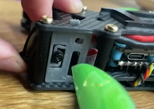
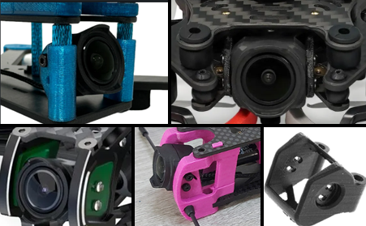

# DJI

DJI started to add gyro data to their products with the release of DJI Avata. DJI gyro data has lens profile built in and doesn't require any synchronization. It therefore works out of the box, just drag & drop the video file, click Export and you're good to go.


**Important!** In-camera stabilization (EIS/Rocksteady) needs to be **disabled**, and FOV needs to be set to **Wide.** Otherwise your camera **will not** record gyro data and won't be usable in Gyroflow.\
\
Ultrawide and Normal lens modes are **not supported.**


## Supported models

<table><thead><tr><th width="142">Model</th><th width="111">Gyro data</th><th width="124">Lens profile</th><th width="159">Synchronization</th><th>Remarks</th></tr></thead><tbody><tr><td>Avata Avata 2</td><td>✅ </td><td>✅ Official</td><td>✅ Not needed</td><td></td></tr><tr><td>O3 Air Unit</td><td>✅ </td><td>✅ Official</td><td>✅ Not needed</td><td>Needs to be soft-mounted</td></tr><tr><td>Action 2</td><td>✅ </td><td>✅ Official</td><td>✅ Not needed</td><td>Since firmware v01.04.0510</td></tr><tr><td>Action 3</td><td>❌</td><td>❌</td><td>❌</td><td>❌ Won't be supported</td></tr><tr><td>Action 4</td><td>✅ </td><td>✅ Official</td><td>✅ Not needed</td><td></td></tr><tr><td>DJI FPV</td><td>❌</td><td>❌</td><td>❌</td><td>❌ Won't be supported</td></tr></tbody></table>

## Split recording

DJI cameras have a file size limit of 4 GB. If the recording is longer, it will be split into multiple parts. If you want to stabilize such split video, you'll have to merge the parts before stabilization.

Gyroflow can do that for you. Just drag & drop all your files in the sequence to Gyroflow to merge.

You can find more information on the [**🎞 File joiner**](../file-joiner.md) page.

## DJI O3 Air Unit vibration issues

A common issue with the O3 Air Unit is that after stabilization, the video is more shaky than before. This happens because the camera module is very lightweight and is often hard-mounted to the drone frame, which makes it very prone to collect noise from the motors.

This can be prevented by applying some or all of these possible solutions:

### 1. Change the motor PWM frequency from 24 kHz to 48 kHz

The default 24 kHz PWM frequency creates interference with the IMU sampling frequency. You can adjust the motor PWM in your ESC[^1] to 48 kHz or more, to avoid this interference. For most ESC's you can use [BLHeli Suite or BLHeli Configurator](http://www.multirotorguide.com/guide/blheli-suite-and-blheli-configurator-how-to-download-install-use-blhelisuite/).

### 2. Soft mount the camera

You should avoid hard mounting the O3 Air Unit camera to the drone frame. It needs some kind of dampening to filter out the noise from the motors. Here's a good example of a soft mounted camera:

<figure><figcaption></figcaption></figure>

Link to thingiverse: [https://www.thingiverse.com/thing:5674654](https://www.thingiverse.com/thing:5674654)

TPU or rubber inserts also work fine, here are some other examples:

<figure><figcaption></figcaption></figure>

### 3. Make sure your lens is not loose

Some people reported that the lens of the camera unit can become loose and needs to be glued.\
If nothing else helps, chances are you also have this issue. Check out this video for explanation and details:



### 4. Make sure your quad is properly tuned

If your quadcopter is well tuned and doesn't vibrate by it's own, it's less likely to create problems for the O3 Air Unit. Make sure you're using fresh, well-balanced propellers, your quad doesn't have resonance issues and you are using [RPM filtering](https://oscarliang.com/rpm-filter/).&#x20;

### 5. Read the official O3 Air Unit manual for more details

Check out page 7 in the [DJI O3 Air Unit user manual](https://dl.djicdn.com/downloads/DJI\_O3\_Air\_Unit/20221123/DJI\_O3\_Air\_Unit\_User\_Manual\_v1.0\_EN.pdf).

### 6. Watch a video by Mads Tech about this issue



### 7. Make sure the Air Unit power supply is filtered by a Low ESR capacitor

Some people reported issues with the O3 Air Units when it was powered directly from the LiPo, without a proper (or big enough) Low ESR capacitor on the power line.&#x20;

## Jello or similar vibrations

If your stabilization is generally working fine, but it adds jello effect (horizontally wobbling lines/blocks), then you can try enabling `Low-pass filter` for the _Motion data_. The amount will depend on your footage fps[^2] and vibration frequency, so you'll have to play around with the filtering value until your footage looks good. In general going lower than 30 Hz is not recommended.



## Shutter speed, ND filters and motion blur

You should avoid motion blur when recording, read more why in the [📸 **Common filming tips and issues**](../common-filming-tips-and-issues.md).

## Using DJI as external logger

DJI doesn't record the IMU data directly. It only contains Quaternions, which is the final computed camera position.

In order to use that data to stabilize another camera, you have to set`Integration method` to **None**.

Because optical flow data on the chart displays gyroscope information and we don't have it, we can't rely on the charts for synchronizing gyro with video. Instead, **Autosync** should do a good job as long as the **Sync search size** is large enough to cover the time difference between starting the DJI camera and your cinema camera.&#x20;

If you can't get the synchronization working, try increasing **Sync search size** even further

To view quaternions on the chart, right click on the timeline and choose **View mode: Quaternions**

[^1]: Electronic speed controller

[^2]: frames per second
