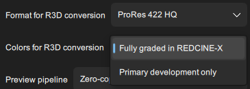
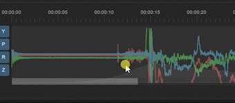

# RED

RED cameras record motion data internally in the **.R3D** files and Gyroflow supports these files directly.

## Supported models

| Model        | Gyro data | Lens profile                                   | Synchronization |
| ------------ | --------- | ---------------------------------------------- | --------------- |
| RED V-Raptor | ✅         | <mark style="color:yellow;">⚠️</mark> By users | ❗Needed         |
| RED KOMODO   | ✅         | <mark style="color:yellow;">⚠️</mark> By users | ❗Needed         |


Gyro data is recorded only in the **.R3D** file format.&#x20;

ProRes (.mov) doesn't include the gyro data.


## RED RAW playback

Gyroflow supports loading **.R3D** files directly in the main app, so there's no need for transcoding. That feature was kindly sponsored by the community.

## Project frame rate

If you shoot in a VFR mode (e.g. 120 fps stored as 30 fps file, slowed down), then Gyroflow will detect that and the load correct frame rate from the metadata automatically.

## Exporting

Exporting directly from Gyroflow when using an **.R3D** file is supported, but it uses an intermediate conversion step and needs _REDline_ (available with the REDCINE-X installation) to convert R3D to ProRes before stabilizing.

Basically when you click **Export** Gyroflow will call _REDline_ program to convert R3D to ProRes behind the scenes and then it will use that converted ProRes to actually perform the stabilization and final export to desired output format. This also works in the render queue.

You can control the format of that intermedia file in the Advanced tab:

<figure><figcaption>
You need REDCINE-X installed to see these settings
</figcaption></figure>


The ProRes format used for the conversion is not related to the actual Export settings.

For example if you use ProRes proxy for the intermediate file and then set ProRes 4444 in the main export settings, your quality will be ruined, because it will take pixels from that Proxy file.

Make sure you have set both ProRes formats correctly. You can also export H.264, H.265 or any other format for the stabilized file, but the intermediate file can only be ProRes.


The ProRes file is always created next to the original .**R3D** file with the **.mov** extension. If that file already exists, the conversion step is skipped. This is convenient when trying different stabilization settings or different trim range exports, but keep in mind that if you want to change colors (e.g. you converted once with [LOG colors](#user-content-fn-1)[^1] and then want to switch to fully graded, you'll have to delete that **.mov** file and let Gyroflow convert it again with your new settings. If that file is corrupted it will also show an error so keep that in mind.


Remember to delete the intermediate .mov file when you change the conversion format settings.


While that works, it is recommended to use one of the [video editor plugins](../../video-editor-plugins/general-plugin-workflow.md) to render out from your video editor.

There are plans to rewrite the rendering pipeline to allow exporting ProRes directly from .R3D in Gyroflow, but it will take at least several months.

Using the plugin is the best option anyway because you then have all RAW color controls without compromises. Learn more here:


[general-plugin-workflow.md](../../video-editor-plugins/general-plugin-workflow.md)


## Lens metadata

Gyroflow will also read lens name and focal length from the **.R3D** file if it's provided by the camera. This allows it to autofill all the needed settings in the lens calibrator and to uniquely identify the lens profile to load it automatically.

If the lens name is not provided by the camera, you can edit the metadata in REDCINE-X and Gyroflow will also read it from there (it is stored in the .RMD file).

## Gyro bias

Estimating gyro bias can help achieve better stabilization results. To estimate the bias, you'll need to have a moment in your video where the camera is not moving at all. In the FPV case it can be before take off.&#x20;

To estimate gyro bias, go to the moment where the camera is not moving, right click on the timeline and select **Estimate gyro bias here**. Then remove all sync points and do the synchronization again.

<figure><figcaption>
Gyro bias estimation
</figcaption></figure>

## Shutter speed, ND filters and motion blur

You should avoid motion blur when recording if you want to stabilize in post, read more why in the [📸 **Common filming tips and issues**](../common-filming-tips-and-issues.md).

[^1]: Primary development only
