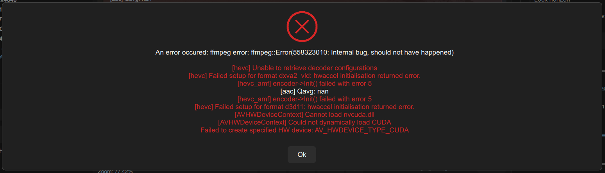
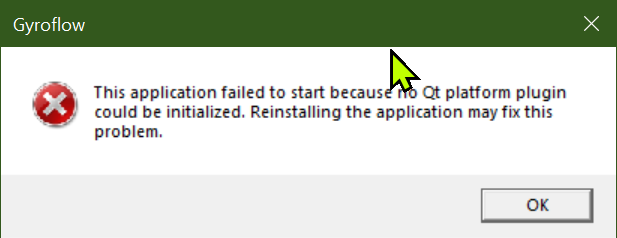
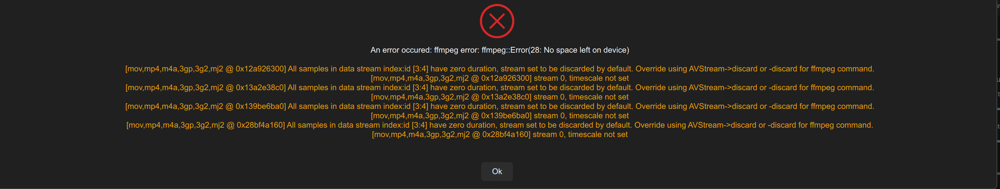
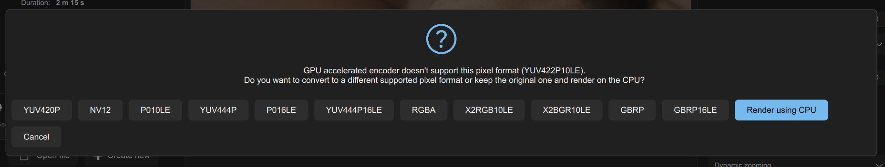
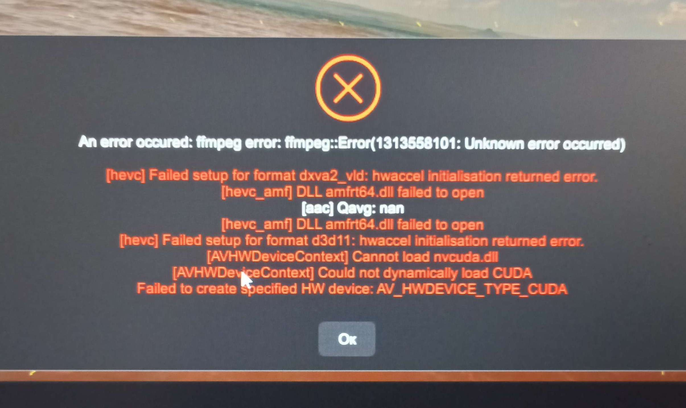
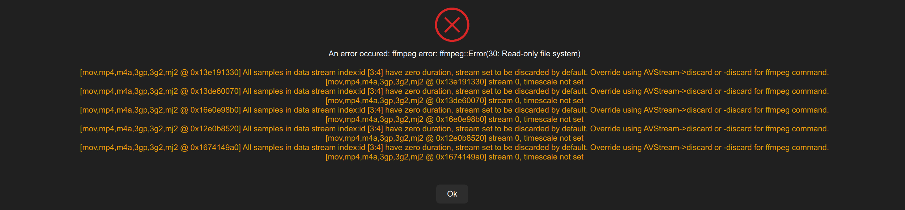
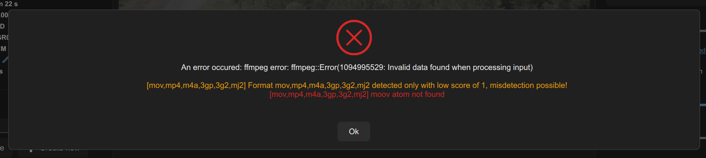

# 🐞 Troubleshooting

## Failed to start on Windows

<figure><figcaption></figcaption></figure>

If you see the following message or similar mentioning `VCRUNTIME140.dll`, install [**VC redist**](https://aka.ms/vs/17/release/vc\_redist.x64.exe)

## Failed to export HEVC

If you see an error message like this:

<figure><figcaption></figcaption></figure>

...then:

* If you're on Windows or Linux, make sure you're using the latest drivers for your GPU.
* If you're using an older GPU, it may not support hardware HEVC encoding, in which case, you should try H.264 instead.
* If H.264 also fails, try disable GPU encoding completely.

## Application failed to start

If you see an error message like this on Windows:

<figure><figcaption></figcaption></figure>

Please try downloading Gyroflow again. Everything you need is in the ZIP file that you download - you don't need to install any other dependancies manually.

## No space left on device

If you see an error message like this:

<figure><figcaption></figcaption></figure>

It means your hard drive doesn't have enough space for `ffmpeg` to render to. Please make some room and try again.

## Doesn't support this pixel format

If you see an popup like this:

<figure><figcaption></figcaption></figure>

It means your physical GPU hardware doesn't support the pixel format you're attempting to render to (i.e. normally it means your GPU hardware doesn't support 4:2:2 10-bit).

You can click **Render using CPU**, to render using the CPU instead of the GPU to maintain full quality, or you can pick another pixel format.

## Unknown Error Occurred

If you see an error message like this:

<figure><figcaption></figcaption></figure>

...then:

* If you're on Windows or Linux, make sure you're using the latest drivers for your GPU.
* If you're using an older GPU, it may not support hardware HEVC encoding, in which case, you should try H.264 instead.
* If H.264 also fails, try disable GPU encoding completely.

## Read Only File System

If you see an error message like this:

<figure><figcaption></figcaption></figure>

...and you're on Mac, make sure you install **Gyroflow** in your **Applications** folder and do NOT run it from the downloaded DMG package. Due to macOS sandboxing, Gyroflow isn't allowed to write to inside the package.&#x20;

## Invalid data found when processing input

If you see an error message like this:

<figure><figcaption></figcaption></figure>

...and you're working with RED `R3D` files, try deleting the `MOV` file that Gyroflow created next to the `R3D` file, and try again.

##
