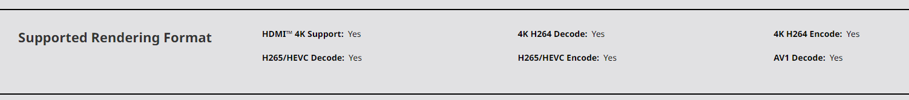

# 🔴 AMD

AMD GPUs have the hardware accelerated video encoder called _Advanced Media Framework_.&#x20;

The AMF[^1] encoder is well supported in Gyroflow and offers fast video render times on Windows and Linux.


**Important!** Always make sure you have the latest driver installed from the official [AMD Drivers](https://www.amd.com/en/support) page. As long as your GPU has the hardware encoder, most acceleration issues are solved by installing the latest driver.

However, someone reported a crash in a certain driver with Rx550, so if you're getting [this issue](https://github.com/gyroflow/gyroflow/issues/677), try a different driver version.


## Supported graphic cards

Refer to the official product page on amd.com to find out if it supports hardware video encoding.

For example the [AMD Radeon™ RX 6800](https://www.amd.com/en/products/graphics/amd-radeon-rx-6800) supports both H.264 and H.265 encoding, as per the specification:

<figure><figcaption>
Look for H264 Encode and HEVC Encode in the specs
</figcaption></figure>

## 10-bit support

TODO: find documentation

## ProRes/DNxHD support

AMD's AMF encoder supports only H.264 and H.265. No other codec is hardware accelerated on AMD cards.

## Maximum supported resolution

8192x8192 is the maximum supported resolution on modern cards.

TODO: find documentation

## Known issues

Some AMD GPU encoders have a bug where it limits the bitrate to 20 Mbps, if the target bitrate is greater than 100 Mbps. Please check the file bitrate after rendering and if you're affected by this bug, you can either:&#x20;

* Set output bitrate to less than 100 Mbps
* Use **Custom encoder options**: `-rc cqp -qp_i 28 -qp_p 28`

[^1]: Advanced Media Framework
