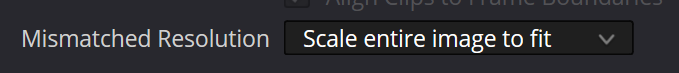

# 🗃️ CSV Export

### Exporting from the app 

You can export the gyro data using the **Motion Data -> Export option** in the app

<figure><figcaption></figcaption></figure>

\- **Camera data** - contains original gyroscope and accelerometer data + integrated quaternions and euler angles. It can be exported to CSV, JSON, USD or JSX (which can be imported in Adobe After Effects by using File -> Run Script)\
\- **Full metadata** - contains original metadata as parsed from the source file, without any Gyroflow calculations\
\- **Parsed metadata** - contains metadata which is used by Gyroflow, and is already pre-calculated as needed by Gyroflow stabilization algorithms\
\- **Project file (with processed gyro data) -** is a project file + parsed metadata + synced timing info

### Gyroflow to CSV python script 

Gyroflow to CSV by [EmberLightVFX](https://github.com/EmberLightVFX) can convert Gyroflow project files to a CSV format containing the camera motion. This can be imported in software such as Blackmagic Fusion, Nuke and Unreal Engine, and may be used for visual effects work.

You can learn more [here](https://github.com/EmberLightVFX/GyroFlow-to-CSV).
