# 🔌 DaVinci Resolve (OpenFX)

## Installation

The Gyroflow OpenFX Plugin works on Mac, Windows and Linux:



### Installing the OpenFX plugin

1. Download the latest version from [https://gyroflow.xyz/download#plugins](https://gyroflow.xyz/download#plugins)&#x20;
2. Create the OFX folder: `/Library/OFX/Plugins`. You can do that in Finder or in the Terminal: `sudo mkdir -p /Library/OFX/Plugins ; open /Library/OFX/Plugins`.
3. Run `Gyroflow-ofx-macosx.dmg`
4. Copy `Gyroflow.ofx.bundle` folder to `/Library/OFX/Plugins/`


**IMPORTANT:** Make sure the OFX folder is in the root `/Library` folder, not your user `/Users/YOUR-USER-NAME/Library` folder.


<figure>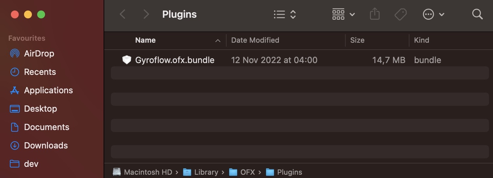<figcaption>
Properly installed plugin on macOS
</figcaption></figure>

### Hardware Acceleration

Gyroflow OFX plugin supports **Metal** acceleration on Mac.



### Installing the OpenFX plugin

1. Download the latest version from [https://gyroflow.xyz/download#plugins](https://gyroflow.xyz/download#plugins)
2. Extract `Gyroflow-ofx-windows.zip` somewhere
3. Create the OFX folder: `C:\Program Files\Common Files\OFX\Plugins`.
4. Copy `Gyroflow.ofx.bundle` folder to `C:\Program Files\Common Files\OFX\Plugins`

<figure>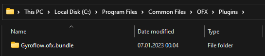<figcaption>
Properly installed plugin on Windows
</figcaption></figure>

### Hardware Acceleration

Gyroflow OFX plugin supports OpenCL and CUDA acceleration on Windows



### Installing the OpenFX plugin

1. Download the latest version from [https://gyroflow.xyz/download#plugins](https://gyroflow.xyz/download#plugins)&#x20;
2. Create the OFX folder: `/usr/OFX/Plugins`.&#x20;
   1. You can do that in the Terminal: `sudo mkdir -p /usr/OFX/Plugins && sudo chown $USER /usr/OFX/Plugins`.
3. Extract`Gyroflow-ofx-linux.zip` to `/usr/OFX/Plugins`

<figure>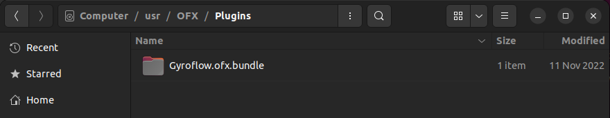<figcaption>
Properly installed plugin on Linux
</figcaption></figure>

### Hardware Acceleration

Gyroflow OFX plugin supports OpenCL and CUDA acceleration on Linux



## Source Code

You can find the source code for this OpenFX plugin on GitHub [here](https://github.com/gyroflow/gyroflow-ofx).

## Nightly Builds

Development moves fast and there are new features added very often, check them out by downloading the nightly build:

* [Nightly OpenFX Build for Mac](https://nightly.link/gyroflow/gyroflow-ofx/workflows/build/main/gyroflow-ofx-macosx.zip)
* [Nightly OpenFX Build for Windows](https://nightly.link/gyroflow/gyroflow-ofx/workflows/build/main/gyroflow-ofx-windows.zip)
* [Nightly OpenFX Build for Linux](https://nightly.link/gyroflow/gyroflow-ofx/workflows/build/main/gyroflow-ofx-linux.zip)
* [Nightly Gyroflow Build](https://gyroflow.xyz/devbuild/?autodownload)

The list of all nightly builds is available on [GitHub actions](https://github.com/gyroflow/gyroflow-ofx/actions).

## Supported Hosts

This **OpenFX** plugin has been primarily built for Blackmagic's **DaVinci Resolve**, however it has also been tested in **MAGIX Vegas**.

It may also work in other OpenFX-compatible hosts, such as **Baselight**, **DVS Clipster**, **Nuke** & **SCRATCH**, however it's currently untested.&#x20;

If you would like to this OpenFX Plugin it in another application, and it's not working correctly, please [post a GitHub issue](https://github.com/gyroflow/gyroflow-ofx/issues).

## Known Issues

**MAGIX Vegas** only works in Full resolution preview. Things will look incorrect when in preview mode, but will appear correct when in Full resolution and after rendering.

MAGIX Vegas uses non-standard BGR pixel data in previews, and there's currently not enough interest in adding support for this in Gyroflow. Please [submit an issue](https://github.com/gyroflow/gyroflow-ofx/issues) if you disagree.

## Interface

This section explains the various sections of the OpenFX Plugin Interface.

<figure>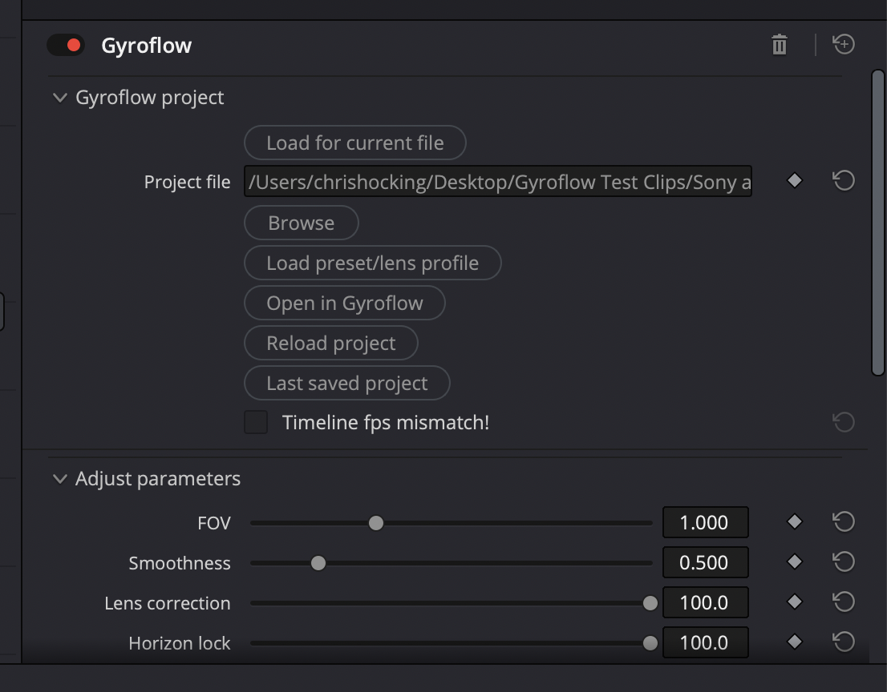<figcaption></figcaption></figure>

### Gyroflow Project

#### Load for current file

This feature relies on external scripting and is only available in paid DaVinci Resolve Studio.

To use this feature, you also have to allow executing external scripts.

You can do this by going to **Preferences...**

<figure>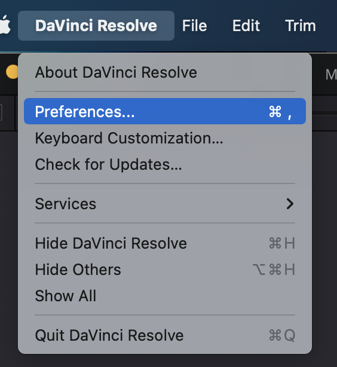<figcaption></figcaption></figure>

Then within the **General** section, make sure **External scripting using** is set to **Local**.

<figure>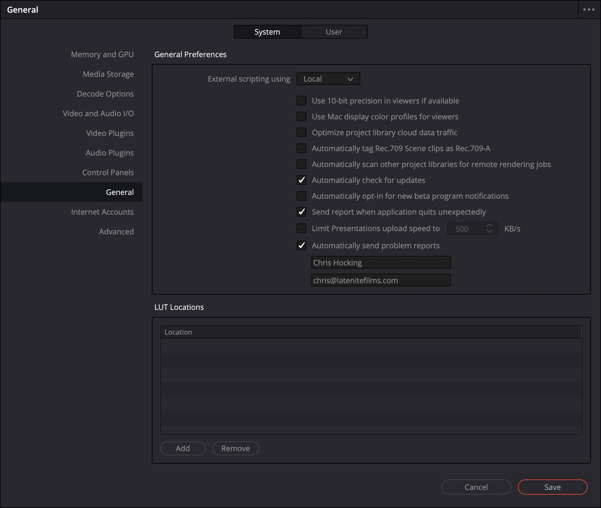<figcaption></figcaption></figure>

For this feature to work, you must have the clip you want to apply Gyroflow to selected in the **Edit** page or in the **Color** page.

It is also impossible to query file path on a **Compound Clip**. In any case, you can just select the video or project file using the **Browse** button, as explained next...

#### Browse

If you're not able to use the **Load for current file** feature, you can manually **Browse** for a Gyroflow Project. Just click the **Browse** button and navigate to wherever your Gyroflow Project is saved.

The OpenFX Plugin will remember the last opened folder.

<figure>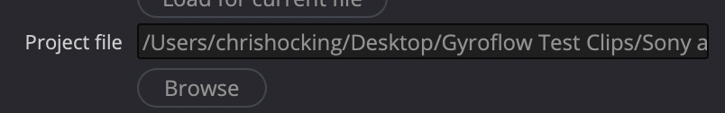<figcaption></figcaption></figure>

#### Load preset/lens profile

Clicking the **Load preset/lens profile** button allows you to select a **Preset** or **Lens Profile**.

Lens calibration is a very important piece of the stabilization algorithm and it's very important to use accurate lens profile when stabilizing a video in Gyroflow. You can learn more [here](../getting-started/lens-calibration.md).

On macOS, the built-in Lens Profiles are located at:

`/Applications/Gyroflow.app/Contents/Resources/camera_presets`

<figure>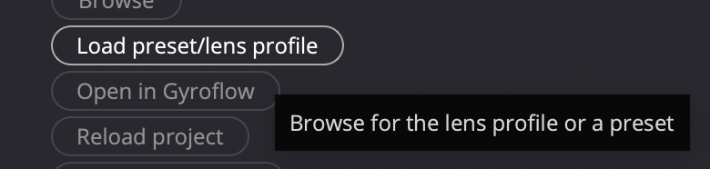<figcaption></figcaption></figure>

#### Open in Gyroflow

If you already have a Gyroflow Project loaded, pressing **Open in Gyroflow** will open this project in Gyroflow. If you don't already have a Gyroflow Project loaded, this will just open Gyroflow in it's default state.

<figure>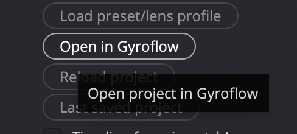<figcaption></figcaption></figure>

#### Reload Project

If you already have a Gyroflow Project loaded, pressing the **Reload Project** button will reload the project from the filesystem. This is useful if you've made changes in the main Gyroflow application, but now want to update the OpenFX Plugin.

<figure>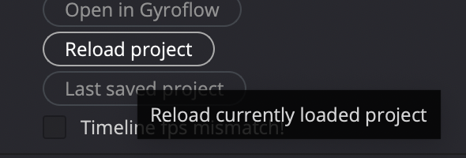<figcaption></figcaption></figure>

#### Last saved project

This is a convenince function that allows you to load the last saved project in the main Gyroflow application to the OpenFX plugin. This is useful if you're working on the free version of DaVinci Resolve, and you don't have access to the **Load for current file** feature.

<figure>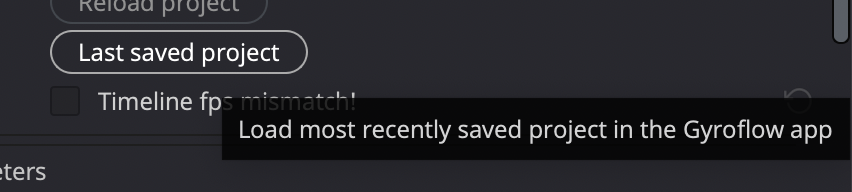<figcaption></figcaption></figure>

#### Status Message

Underneath the **Last save project** button is a checkbox that displays a status message. This is useful to determine if everything is working correctly, or if there's any issues or problems - for example, a frames per second mismatch:

<figure>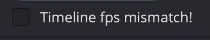<figcaption></figcaption></figure>

If everything is correct and working, you'll see this:

<figure>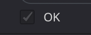<figcaption></figcaption></figure>

### Adjust Parameters

This section allows you to manually adjust several Gyroflow parameters directly within the OpenFX plugin. You can also apply keyframes.

<figure>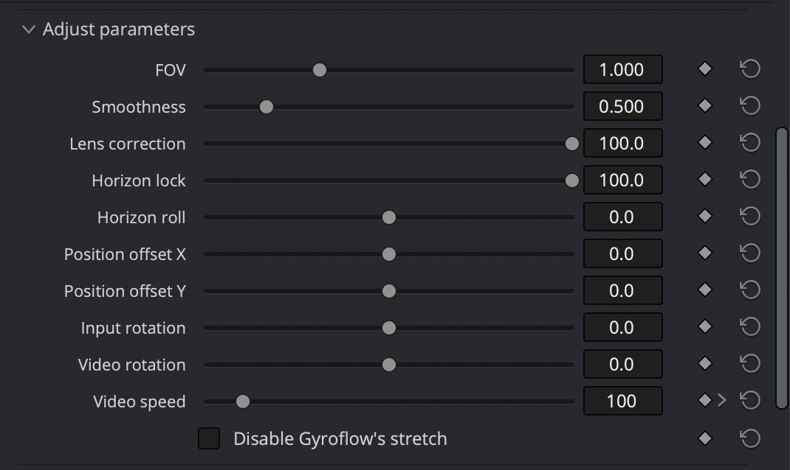<figcaption></figcaption></figure>

#### Video Speed

Use this slider to change video speed or keyframe it, instead of built-in speed changes in the editor.

#### Disable Gyroflow's stretch

If you used Input stretch in the lens profile in Gyroflow, and you de-stretched the video separately in Resolve, check this to disable Gyroflow's internal stretching.

### Keyframes

This section allows you to control how the OpenFX handles keyframes.

<figure>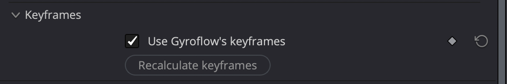<figcaption></figcaption></figure>

#### Use Gyroflow's keyframes

Ticking this uses Gyroflow's internal keyframes, instead of the ones in your host application (i.e. DaVinci Resolve). This is enabled by default.

#### Recalculate keyframes

This button allows you to recalculate keyframes after adjusting the splines (in Fusion mode).

### Additional Settings

This section covers the additional settings at the bottom of the OpenFX settings.

<figure>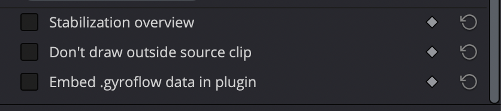<figcaption></figcaption></figure>

#### Stabilization overview

This allow you to zoom out the view to see the stabilization results. This is very useful to see if and how Gyroflow is working. You should disable this before rendering.

#### Don't draw outside source clip

When clip and timeline aspect ratio don't match, draw the final image inside the source clip, instead of drawing outside it.

#### Embed .gyroflow data in plugin

If you intend to share the host (i.e. DaVinci Resolve) project to someone else, the plugin can embed the Gyroflow project data including gyro data inside the host project. This way you don't have to share `.gyroflow` project files. Enabling this option will make the project bigger. This option is off by default.

## Workflow

### Using on the Cut/Edit Page

Under Construction.

### Using on the Color Page

Under Construction.

### Using as a Fusion Node

Under Construction.

## Troubleshooting

### Frame Rate Mismatch

Under Construction _(make sure your timeline framerate matches your clip framerate)_

### Handling Different Aspect Ratios

Under Construction _(AdrianEddy to write)_
